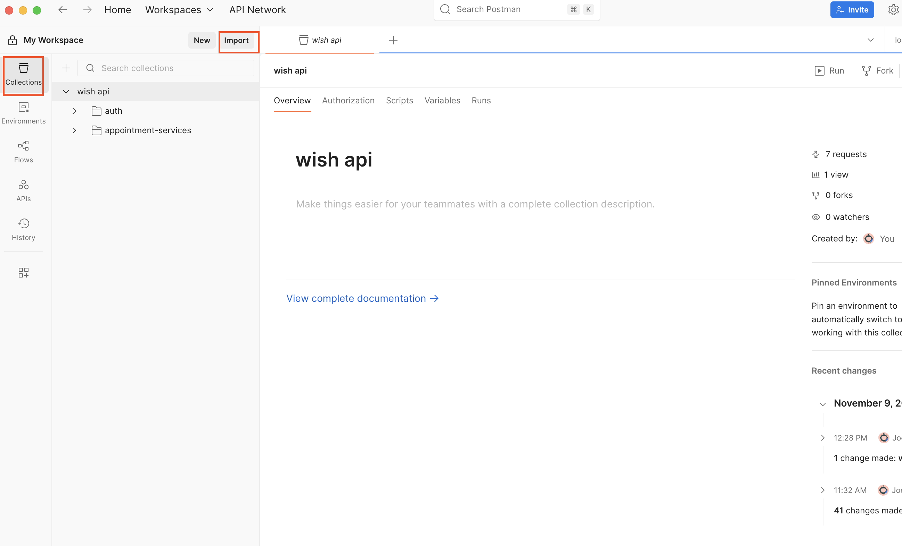
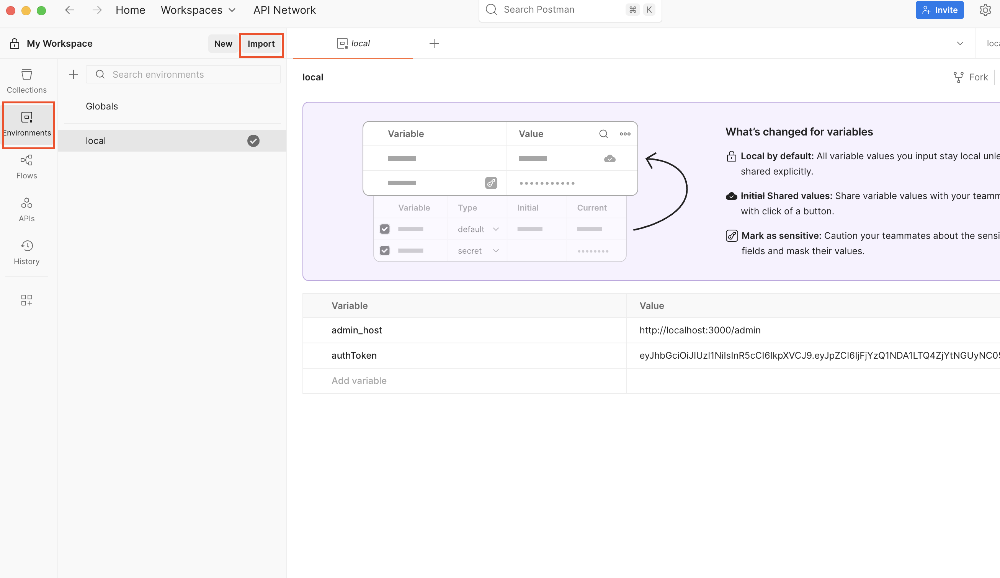
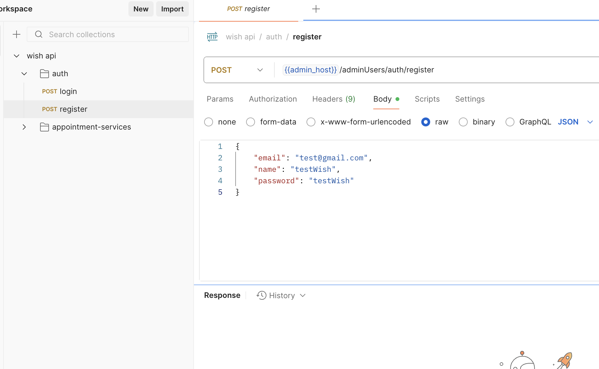
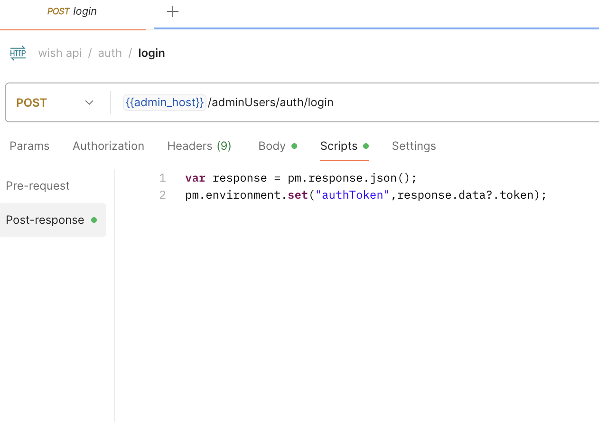
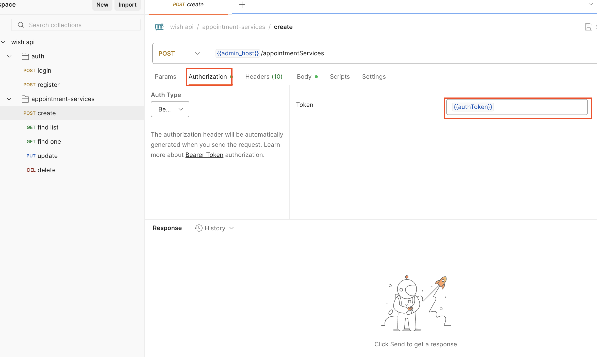

# Wish

一個基於 NestJS 的後端 API 服務專案，提供使用者管理、預約服務等功能。

## 技術棧

- **框架**: NestJS 11.x
- **語言**: TypeScript
- **資料庫**: MySQL
- **ORM**: TypeORM
- **驗證**: JWT (Passport)
- **密碼加密**: bcryptjs

## 專案結構

```
backend/
├── src/
│   ├── core/              # 核心功能模組
│   │   ├── base/          # 基礎類別與控制器
│   │   ├── databases/     # 資料庫配置
│   │   ├── enums/         # 列舉定義
│   │   ├── exceptions/    # 自訂例外處理
│   │   ├── filters/       # 全域過濾器
│   │   ├── jwt/           # JWT 驗證
│   │   └── middlewares/   # 中介軟體
│   ├── modules/           # 功能模組
│   │   ├── users/         # 使用者管理
│   │   └── appointment-services/  # 預約服務
│   └── migrations/        # 資料庫遷移檔案
└── test/                  # 測試檔案
```

## 環境需求

### 使用 Docker（推薦）

- Docker >= 20.x
- Docker Compose >= 2.x

### 本地開發

- Node.js >= 20.x
- npm >= 8.x
- MySQL >= 8.x

## 快速開始（使用 Docker）

### 1. 使用 Docker Compose 一鍵啟動

這是最簡單的方式，會自動建立 MySQL 資料庫和 Backend 服務：

```bash
# cd 到 wish 目錄下
cd wish

# 啟動所有服務（生產模式）
docker-compose up -d
```

服務啟動後：

- Backend API: `http://localhost:3000`
- MySQL: `localhost:3306`

### 3. 停止服務

```bash
# 停止服務
docker-compose down

# 停止服務並刪除資料卷（⚠️ 會清空資料庫）
docker-compose down -v
```

## 快速開始（使用 OA Run）

```bash
# 進入專案目錄
cd backend

# 安裝依賴套件
npm install
```

## 環境變數設定

在 `backend` 目錄下建立 `.env` 檔案：

可以直接複製 .env.example，需自行修改 DB_HOST

## 資料庫遷移

```bash
# 建立新的遷移檔案
npm run migration:create --data-source=master --name=YourMigrationName

# 生成遷移檔案（根據實體變更）
npm run migration:generate --data-source=master --name=YourMigrationName

# 執行遷移
npm run migration:run --data-source=master

# 回復上一次遷移
npm run migration:revert --data-source=master
```

## 啟動專案（本地開發）

```bash
# 進入 backend 目錄
cd backend

# 開發模式（支援熱重載）
npm run start:dev

# Debug 模式（使用 VS Code，按 F5）
# 或在終端機執行
npm run start:debug
```

## 測試

```bash
# 單元測試
npm run test
```

## Debug 模式

```bash
使用vscode，直接按 F5 即可
```

## Postman API 測試

完成 Docker 啟動或本地啟動後，即可使用 Postman 測試 API。

### 匯入 Postman Collection

1. 開啟 Postman 應用程式
2. 點擊左上角的 **Import** 按鈕
3. 選擇 **File** 標籤
4. 瀏覽並選擇 `postman/collections/wish api.postman_collection.json`
5. 點擊 **Import** 完成匯入



### 設定 Environment

1. 在 Postman 中點擊右上角的 **Environments**
2. 點擊 **Import** 按鈕
3. 選擇 `postman/environments/local.postman_environment.json`
4. 匯入後，在右上角下拉選單中選擇 **Wish Development** 環境



### 環境變數說明

開發環境預設變數：

- `admin_host`: `http://localhost:3000`
- `authToken`: 登入後自動設定

### 使用流程

1. **註冊管理員帳號**

   - 執行 `auth > register` 請求

   

2. **登入取得 Token**

   - 執行 `auth > login` 請求
   - Token 會自動儲存到環境變數中

   

3. **測試 API**

   - 執行其他需要驗證的 API
   - Authorization header 會自動帶入 Token

   

### Collection 結構

```
Wish API Collection
├── auth                    # 認證相關
│   ├── register            # 註冊管理員
│   └── Login               # 登入
├── appointment-services    # 預約服務
│   ├── find list           # 取得所有服務
│   ├── find one            # 取得單一服務
│   ├── create              # 建立服務
│   ├── update              # 更新服務
│   └── delete              # 刪除服務
```

## 主要功能

### 使用者管理

- 管理員使用者註冊與登入
- JWT 身份驗證
- 使用者權限管理

### 預約服務

- 服務項目管理（CRUD）
- 預約服務查詢
- 服務資料分頁

### 核心功能

- 全域例外處理
- 統一回應格式
- 分頁查詢支援
- 請求日誌記錄

## API 文件

服務啟動後，預設在 `http://localhost:3000` 運行。

主要端點：

- `/admin/*` - 管理員相關 API
- `/auth/*` - 認證相關 API
- `/appointment-services/*` - 預約服務相關 API
